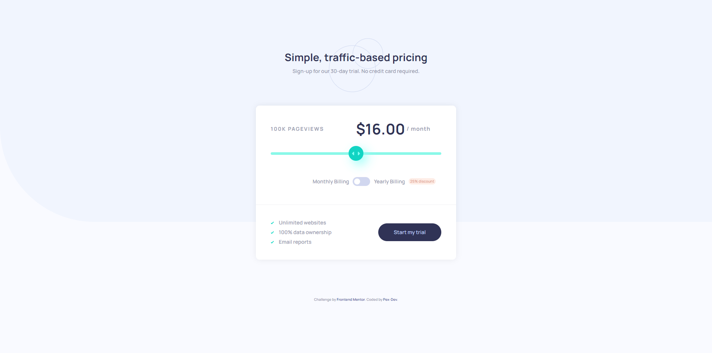
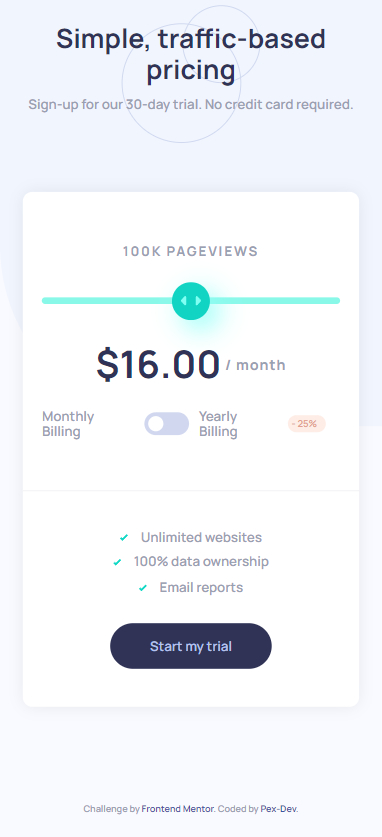

# Frontend Mentor - Interactive pricing component solution

This is a solution to the [Interactive pricing component challenge on Frontend Mentor](https://www.frontendmentor.io/challenges/interactive-pricing-component-t0m8PIyY8). Frontend Mentor challenges help you improve your coding skills by building realistic projects. 

## Table of contents

- [Overview](#overview)
  - [The challenge](#the-challenge)
  - [Screenshot](#screenshot)
  - [Links](#links)
- [My process](#my-process)
  - [Built with](#built-with)
  - [What I learned](#what-i-learned)
- [Author](#author)

## Overview

- This page allows users to dynamically select their invoice price using a slider. Additionally, they can switch between monthly and annual billing; if the user chooses annual billing, the price for the entire year is calculated with a 25% discount. 
- I used HTML for the structure, Sass for the styles, and JavaScript for interactivity. Additionally, I used Gulp to compile the Sass code

### The challenge

Users should be able to:

- View the optimal layout for the app depending on their device's screen size
- See hover states for all interactive elements on the page
- Use the slider and toggle to see prices for different page view numbers

### Screenshot

|  |  |
|:------------------------------:|:------------------------------:|
| screenshot of the site on a PC     | screenshot of the site on mobile devices     |

### Links

- Solution URL: [Add solution URL here](https://your-solution-url.com)
- Live Site URL: [Add live site URL here](https://your-live-site-url.com)

## My process

### Built with

- Semantic HTML5 markup
- Sass (Syntactically Awesome Stylesheets)
- Flexbox and Grid
- JavaScript
- Gulp (Task Runner)


### What I learned

- Learned how to style a range element and control its functionality using JavaScript. 
- Also learned to use ternary operators and template literals to insert variables.


```js
 let billing = yearly ? 'year' : 'month';

  if(yearly){
      priceValue = calculatePriceYearly(priceValue);
  }    
  priceText.innerHTML = `$${priceValue}.00<span>/ ${billing}</span>`;
```

### Continued development

In the future, I will focus on learning more about making web pages more interactive using JavaScript. I will also dedicate myself to improving my ability to write more organized and readable code. I feel there is still much for me to learn in these areas, and I am committed to continuing to grow professionally in them.

## Author

- Frontend Mentor - [@Pex-Dev](https://www.frontendmentor.io/profile/Pex-Dev)